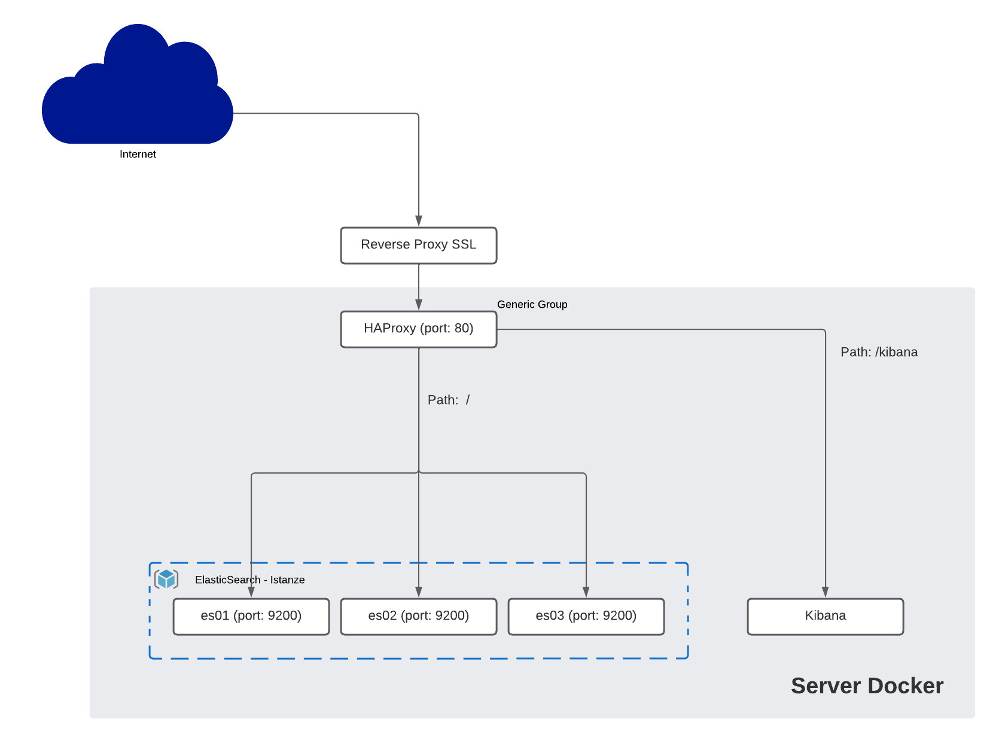

# Cluster Elasticsearch su SWARM

Installazione di un cluster elasticsearch con 3 nodi attivi su Docker in Swarm mode. Le macchine utilizzata in ambiente di sviluppo hanno le seguenti caratteristiche:

| Risorsa   |     Quantità  |
|---------- |:-------------:|
| RAM       |  8GB         |
| CPU cores |  2            |
| HD        |  80GB        |

Memoria assegnata ad ogni istanza: **4GB**

### Versioni software

Docker: **20.10.16**
```bash
$ docker version
Client: Docker Engine - Community
 Version:           20.10.16
 API version:       1.41
 Go version:        go1.17.10
 Git commit:        aa7e414
 Built:             Thu May 12 09:17:23 2022
 OS/Arch:           linux/amd64
 Context:           default
 Experimental:      true

Server: Docker Engine - Community
 Engine:
  Version:          20.10.16
  API version:      1.41 (minimum version 1.12)
  Go version:       go1.17.10
  Git commit:       f756502
  Built:            Thu May 12 09:15:28 2022
  OS/Arch:          linux/amd64
  Experimental:     false
 containerd:
  Version:          1.6.4
  GitCommit:        212e8b6fa2f44b9c21b2798135fc6fb7c53efc16
 runc:
  Version:          1.1.1
  GitCommit:        v1.1.1-0-g52de29d
 docker-init:
  Version:          0.19.0
  GitCommit:        de40ad0
```

Elastic Search: **8.1.3**

## Architettura


Davanti ad HA Proxy deve essere posizionato un reverse proxy per utilizzare connessioni **https**.

Il bilanciatore è configurato in modalità roundrobin e verifica la disponibilità di ogni istanza, escludendola nel caso di fallimento del check.

Gli host docker sono nominati:

swarm1 (leader)
swarm2 (worker)
swarm3 (worker)
swarm4 (worker)

E le istanze elasticsearch sono **costrette** su specifici host:

es01 -> swarm2
es02 -> swarm3
es03 -> swarm4

Se i worker utilizzano un filesystem condiviso allora è possibile eliminare il constraint per il deploy.

## Build delle immagini

```bash
$ docker compose build --build-arg STACK_VERSION="8.1.3"
```

Una volta create le immagini devono essere caricate sul registry per poterle utilizzare in Swarm.

```bash
$ docker compose push
```

## Configurazione

Per configurare il cluster è necessario creare un file **.env** nella cartella contenente il file docker-compose.yml.
I parametri presenti nel file .env non devono essere modificati una volta che il cluster è stato attivato. Alcune delle voci possono essere rese effettive solamente ricreando l'intero cluster.

```ini
# Password for the 'elastic' user (at least 6 characters)
ELASTIC_PASSWORD=DnPNZuKcc7JnygYm

# Password for the 'kibana_system' user (at least 6 characters)
KIBANA_PASSWORD=yPJf8kEsc3kQ4Hko
ELASTICSEARCH_PASSWORD=yPJf8kEsc3kQ4Hko

# Set the cluster name
CLUSTER_NAME=docker-cluster

# Set to 'basic' or 'trial' to automatically start the 30-day trial
LICENSE=basic

# Port to expose Elasticsearch HTTP API to the host
ES_PORT=9200

# Port to expose Kibana to the host
KIBANA_PORT=5601

# Increase or decrease based on the available host memory (in bytes)
MEM_LIMIT=4294967296

# Project namespace (defaults to the current folder name if not set)
COMPOSE_PROJECT_NAME=dataviz

```

## Deploy dello stack

per avviare il cluster, creare il file .env localmente, apportare le modifiche dovute:

```
$ cp .env.example .env
$ vi .env
```

 e poi da linea di comando lanciare:

```bash
$ docker stack deploy --compose-file docker-compose.yml elastic
```
